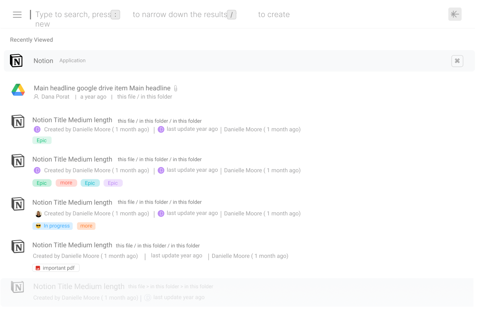

# 

##  What is Unleash?

A revolutionary light-weight search bar that helps users search across their cloud services and PC/Mac with ease

### Productivity in a Click
With seamless searching technology, Unleash eliminates context switches, making your workflow take flight and easing collaboration across teams.

### All in one place

Get more work done, with less mess by integrating to some of the most widely used applications. Search with Unleash to find what you are looking for with a single search and receive relevant ranked results in lightening speed.

##  Downloads
|  |   |  
| -- | -- |
| Windows |  | 
| macOS (Universal) |  | 
| macOS (x64) |  | 
| macOS (ARM64) |  | 
| Linux (rpm) |  | 
| Linux (deb) |  | 

##  Community and Help
* Check our [User Guide](https://unleash.wiki/user-guide) to explore and learn all the feature of Unleash.
* Check the [Release Notes](https://unleash.wiki/release-notes) to get updated with new versions 
* [Join Unleash on Slack](https://join.slack.com/t/chaseappcommunity/shared_invite/zt-mn213lhc-lrRupDAsA_EqiswAAbB0~w) if you want to ask questions, suggest an improvement and stay up to date with Unleash releases.

